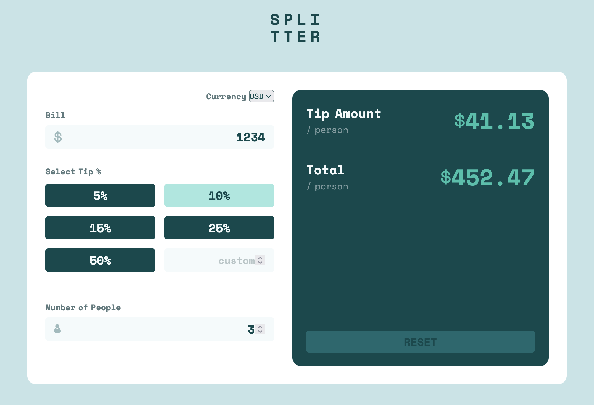

# Frontend Mentor - Tip calculator app solution

This is a solution to the [Tip calculator app challenge on Frontend Mentor](https://www.frontendmentor.io/challenges/tip-calculator-app-ugJNGbJUX). Frontend Mentor challenges help you improve your coding skills by building realistic projects.

## Overview

### The challenge

Users should be able to:

- View the optimal layout for the app depending on their device's screen size
- See hover states for all interactive elements on the page
- Calculate the correct tip and total cost of the bill per person

### Screenshot

### Links

- Solution URL: [Solution URL](https://github.com/norwegJan/Tip-Calculator-App)
- Live Site URL: [Live site URL](https://norwegjan.github.io/Tip-Calculator-App/)

## My process

### Built with

- Semantic HTML5 markup
- Vanilla CSS
- Vanilla JS
- Flexbox
- CSS Grid
- Mobile-first workflow

### What I learned

For this challenge I had to step back a bit in order to practice and drill in more fundamental JS concepts. So I ended up at Scrimba and did the Learn Javascript and the beginning of the Advanced Javascript courses there. Going through the lessons there was of tremendous help for me in order to get several JS-concepts I had struggled with to finally "click" in place.

I now understand much better how function parameters and arguments work, as this have been a source of confusion for me. I also understand much better how to loop through arrays, and how to utilise if...else and switch statements.

Working on this calculator-app I decided to expand a bit on the original challenge so I added a currency-picker, so the users can choose between four currencies: NOK, EUR, USD or GBP. This forced me to work with arrays, looping and consepts such as number formatting with the Intl.NumberFormat-object. I also added the functionality of saving the last picked currency as a permanent "state", using localStorage.

Initially I struggled a lot with getting the validation logic in place. But using Codex as a mentor assistant (with the mentor role as described in the provided AGENTS.md file) I slowly started to get the hang of it. Codex introduced me to the concept of using "flags" like billDirty, peopleDirty which was of big help when building out the validation logic.

All in all, this was a very challenging, but still fun app to build. For every struggle there's also a lot of learning and it's very satisfying when things finally just clicks in place and I get those "AHA, NOW I get it!"-moments 🤓😃💡

### Useful resources

- [Learn JavaScript by Scrimba](https://scrimba.com/learn-javascript-c0v) - This course helped me a lot with understanding several fundamental JS-concepts I previously had struggled with.
- [Simple Tip Calculator tutorial](https://webdesign.tutsplus.com/how-to-create-a-simple-tip-calculator-with-html-css-and-vanilla-javascript--cms-108505t) - This tutorial and the provided source coude was a great reference to have as a starting point, in order to understand the underlying logic behind a calculator app such as this.

### AI Collaboration

Describe how you used AI tools (if any) during this project. This helps demonstrate your ability to work effectively with AI assistants.

- What tools did you use? -> I used ChatGPT Codex
- How did you use them? -> For debugging and general mentor assistance

## Author

- Frontend Mentor - [@norwegJan](https://www.frontendmentor.io/profile/norwegJan)
